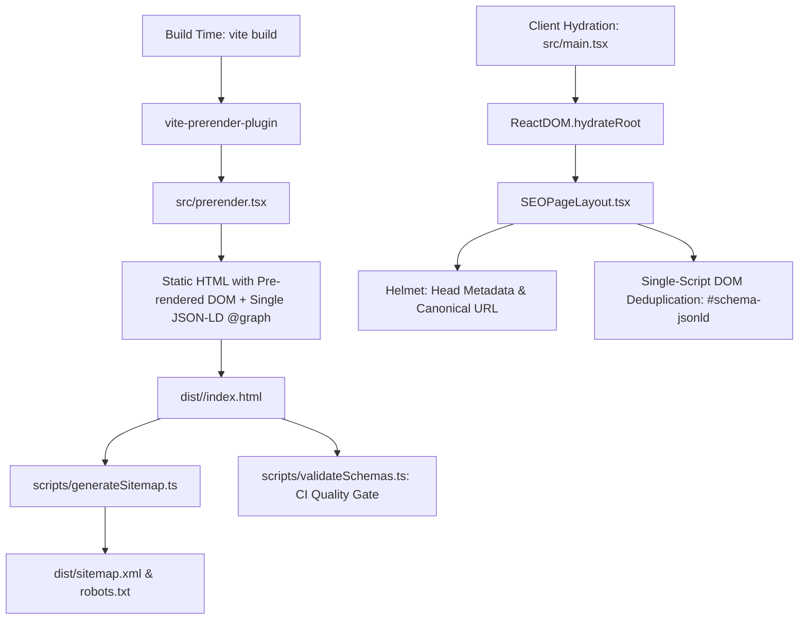

# Enterprise SEO & Rich Results Architecture Documentation

> **Project:** Academy of Internal Audit (`aia-website`)  
> **Target Framework:** React 18/19 + Vite 7 (SSG Pre-rendering) + TypeScript  
> **Status:** Production Ready & 100% Rich Results Compliant

---

## 1. Executive Summary & Architecture Overview

Single Page Applications (SPAs) built with React and Vite traditionally suffer from significant SEO disadvantages:
1. **Empty Initial HTML:** Crawlers (Googlebot, Bingbot, LinkedIn, WhatsApp, Twitter) receive an empty `<div id="root"></div>` without pre-rendered DOM content.
2. **Delayed Title/Meta Execution:** JavaScript hydration delays metadata injection, leading to crawler timeouts or stale social preview snippets.
3. **Fragmented & Duplicate JSON-LD:** Placing multiple `<script type="application/ld+json">` tags across different React components or inside `react-helmet` causes duplicate script tags upon client-side route transitions, triggering Google Search Console errors.
4. **Unlinked Schema Entities:** Emitting loose `Organization`, `Course`, and `LocalBusiness` schemas without semantic `@id` graph relationships prevents search engines from recognizing that courses and reviews belong to the verified corporate entity.

To solve these challenges permanently, this codebase implements an **Enterprise 5-Layer SEO Architecture**:



---

## 2. The 5-Layer SEO Architecture

### Layer 1: Centralized Configuration (`src/config/site.ts`)
- **Single Source of Truth:** Manages canonical origin (`https://aia.in.net`), brand name, primary telephone, email, and brand logos.
- **Pure URL Sanitization:** `getCanonicalUrl(pathname)` deterministically cleans leading and trailing slashes, ensuring every canonical link, OpenGraph URL, and Schema `@id` URI strictly matches the production domain.

### Layer 2: Type-Safe Schema.org Graph Engine (`src/config/seoEngine.ts` & `src/config/schemaExamples.ts`)
- **Type Safety via `schema-dts`:** Every entity (`Organization`, `LocalBusiness`, `WebSite`, `WebPage`, `Course`, `Product`, `SoftwareApplication`) adheres strictly to the official Schema.org specification.
- **Semantic Entity Linking:** All entities reference the canonical organization via `{"@id": "https://aia.in.net/#organization"}`.
- **Single Consolidated `@graph`:** Instead of scattering microdata across multiple tags, all page entities are unified under:
  ```json
  {
    "@context": "https://schema.org",
    "@graph": [
      { "@type": "Organization", "@id": "https://aia.in.net/#organization", ... },
      { "@type": "WebPage", "@id": "https://aia.in.net/cfe-curriculum/#webpage", ... },
      { "@type": "Course", "@id": "https://aia.in.net/cfe-curriculum/#course", ... }
    ]
  }
  ```

### Layer 3: Build-Time Static Pre-rendering (`src/prerender.tsx` & `vite.config.ts`)
- **Flat HTML Output:** Generates pre-rendered `index.html` files for every route (e.g., `dist/cfe-curriculum/index.html`).
- **Zero-JavaScript Crawlability:** When Googlebot or a social scraper requests any page, the complete DOM text, heading hierarchy (`<h1>`-`<h3>`), `<title>`, `<meta name="description">`, `<link rel="canonical">`, and complete JSON-LD `@graph` are immediately available in the raw HTTP response.
- **Event Loop Unblocker:** Includes a critical patch in `vite.config.ts` for Node's `MessagePort.prototype.onmessage` to unref React 18/19 scheduler ports so Vite builds exit cleanly without hanging.

### Layer 4: Hydration & Single-Script Runtime Deduplication (`src/components/SEOPageLayout.tsx`)
- **`<Helmet>` for Meta Only:** `<Helmet>` strictly manages `<title>`, `<meta name="description">`, OpenGraph, Twitter Cards, and canonical tags.
- **Single Script DOM Sync:** A dedicated React `useEffect` manages the `<script id="schema-jsonld">` element in `document.head`.
- **Duplicate Tag Purge:** Whenever client navigation occurs, the component updates the inner text of `#schema-jsonld` and cleans up any rogue or orphaned `application/ld+json` tags that third-party scripts or older components might attempt to insert.

### Layer 5: Automated Sitemap & Post-Build CI Validation (`scripts/`)
- **Dynamic Crawl Discovery:** `scripts/generateSitemap.ts` recursively traverses `dist/`, indexes all pre-rendered HTML files, and outputs an RFC-compliant `sitemap.xml` and `robots.txt` directly to `dist/` and `public/`.
- **CI/CD Quality Gate:** `scripts/validateSchemas.ts` parses all generated HTML files using `node-html-parser`. It validates that:
  - Exactly ONE JSON-LD script exists per HTML file.
  - `@context` is `"https://schema.org"`.
  - `@graph` contains valid, non-empty entity structures.
  - Exits with non-zero error code if any page fails, preventing broken SEO releases.

---

## 3. Google Rich Results Eligibility Breakdown

| Schema Type | Qualifying Pages | Rich Result Eligibility | Critical Fields Included |
| :--- | :--- | :--- | :--- |
| **Course** | `/cams`, `/cfe-curriculum`, `/cia-curriculum`, `/cia-challenge-curriculum`, `/cisa` | **Google Course Carousel & List Snippets** | `name`, `description`, `provider` (linked to Org ID), `hasCourseInstance` (mode, schedule, instructor, location) |
| **Product** | `/`, `/enroll-now` | **Google Merchant Shopping & Review Star Snippets** | `name`, `offers` with `MerchantReturnPolicy` & `OfferShippingDetails`, `aggregateRating`, `review` |
| **SoftwareApplication** | `/` | **Google Software / App Snippets** | `applicationCategory: EducationalApplication`, `operatingSystem: All`, `offers` |
| **LocalBusiness / Org** | `/`, `/contact`, `/corporate-training` | **Google Knowledge Panel & Local Pack** | `name`, `url`, `logo`, `telephone`, `address` with GeoCoordinates, `sameAs` social links |
| **WebSite** | `/` | **Google Sitelinks Searchbox** | `name`, `url`, `potentialAction` (`SearchAction`) |
| **WebPage** | All 20+ Routes | **Breadcrumbs & Enhanced SERP Listings** | `url`, `name`, `description`, `isPartOf` (linked to WebSite ID) |

---

## 4. File-by-File Inventory & Responsibilities

| File Path | Language | Primary Responsibility | Key Dependencies |
| :--- | :--- | :--- | :--- |
| [`src/config/site.ts`](file:///d:/JOB_PROJECTS/igli/src/config/site.ts) | TypeScript | Brand constants, contact information, and pure canonical URL string generator. | None (Pure TS) |
| [`src/config/schemaExamples.ts`](file:///d:/JOB_PROJECTS/igli/src/config/schemaExamples.ts) | TypeScript | Rich Results compliant Schema.org factory builders (`Course`, `Product`, `SoftwareApplication`). | `schema-dts`, `./site` |
| [`src/config/seoEngine.ts`](file:///d:/JOB_PROJECTS/igli/src/config/seoEngine.ts) | TypeScript | Central routing SEO dictionary (`ROUTE_SEO`), composite `@graph` creator, and fallback route resolver (`getSeoForRoute`). | `schema-dts`, `./site`, `./schemaExamples` |
| [`src/components/SEOPageLayout.tsx`](file:///d:/JOB_PROJECTS/igli/src/components/SEOPageLayout.tsx) | TypeScript / React | Head meta tags management via `<Helmet>` and single-script `#schema-jsonld` DOM deduplicator. | `react-helmet-async`, `schema-dts`, `@/config/seoEngine` |
| [`src/routes/AppRoutes.tsx`](file:///d:/JOB_PROJECTS/igli/src/routes/AppRoutes.tsx) | TypeScript / React | Decoupled route table mapping paths to lazy components wrapped in `<PageSEO>`. | `react-router-dom`, `@tanstack/react-query`, `@/components/SEOPageLayout` |
| [`src/routes/blog-redirects.ts`](file:///d:/JOB_PROJECTS/igli/src/routes/blog-redirects.ts) | TypeScript | 301 legacy redirect dictionary protecting incoming search engine backlinks. | None |
| [`src/prerender.tsx`](file:///d:/JOB_PROJECTS/igli/src/prerender.tsx) | TypeScript / React | Server-side build pre-renderer exporting `prerender({ url })` for `vite-prerender-plugin`. | `react-dom/server`, `react-router`, `react-helmet-async`, `vite-prerender-plugin/parse` |
| [`vite.config.ts`](file:///d:/JOB_PROJECTS/igli/vite.config.ts) | TypeScript | Vite configuration with SSG plugin, code splitting, PWA, Brotli/Gzip, and React scheduler unblock fix. | `vite`, `vite-prerender-plugin`, `@vitejs/plugin-react` |
| [`scripts/generateSitemap.ts`](file:///d:/JOB_PROJECTS/igli/scripts/generateSitemap.ts) | TypeScript / Bun | Traverses `dist/` HTML output to generate RFC `sitemap.xml` and `robots.txt` for `dist/` and `public/`. | `node:fs`, `node:path`, `../src/config/site` |
| [`scripts/validateSchemas.ts`](file:///d:/JOB_PROJECTS/igli/scripts/validateSchemas.ts) | TypeScript / Bun | CI quality gate parsing all pre-rendered HTML files to ensure 0 duplicates and valid `@graph` JSON-LD. | `node-html-parser`, `node:fs`, `node:path` |
| [`src/lib/prerender.ts`](file:///d:/JOB_PROJECTS/igli/src/lib/prerender.ts) | TypeScript | Environment checks (`isBrowser`, `isSSGPrerender`) and idle task scheduler (`scheduleIdle`). | Web APIs |
| [`public/.htaccess`](file:///d:/JOB_PROJECTS/igli/public/.htaccess) | Apache Config | Serves pre-rendered static HTML files directly before falling back to React SPA routing, with canonical redirects. | Apache HTTP Server |

---

## 5. Developer Guide: How to Add a New Route with Full SEO

When adding a new page to the application:

### Step 1: Define Metadata and Schemas in `src/config/seoEngine.ts`
Add an entry to `ROUTE_SEO`:
```typescript
'/new-course': {
  title: 'New Course Certification Training | Academy of Internal Audit',
  description: 'Comprehensive preparation for the New Course exam with mock tests and live sessions.',
  keywords: 'new course, internal audit training, certification',
  canonicalPath: '/new-course',
  schemas: [
    organizationSchema,
    createCourseSchema({
      name: 'New Course Certification Program',
      description: 'Master the New Course curriculum with expert guidance.',
      url: getCanonicalUrl('/new-course'),
    }),
  ],
},
```

### Step 2: Add Route to `src/routes/AppRoutes.tsx`
Import your page component lazily and declare the `<Route>` wrapped in `<PageSEO>`:
```tsx
const NewCourse = lazy(() => import('@/pages/Courses/NewCourse'));

// Inside <Routes>:
<Route
  path="/new-course"
  element={
    <PageSEO path="/new-course">
      <NewCourse />
    </PageSEO>
  }
/>
```

### Step 3: Run the Build & Validate
Execute:
```bash
bun run build
bun run test:schema
```
`vite-prerender-plugin` will automatically crawl the new route, generate `dist/new-course/index.html`, add it to `sitemap.xml`, and `validateSchemas.ts` will verify that its JSON-LD `@graph` meets all Google Rich Results standards.

---

## 6. Verification & Health Metrics

To verify the SEO health of the application at any time:
1. **Full Build & Sitemap:** `bun run build`
2. **Schema & Graph Audit:** `bun run test:schema`
3. **Google Rich Results Test:** Submit any pre-rendered URL (e.g., `https://www.aia.in.net/cfe-curriculum`) to [Google Rich Results Test](https://search.google.com/test/rich-results) to observe detected `Course`, `Organization`, and `Breadcrumbs` rich snippets.
