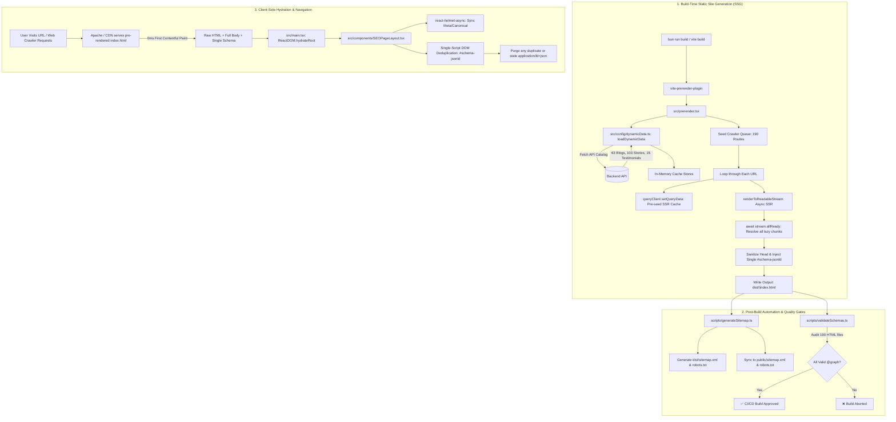

# Enterprise SEO & SSG System Workflow (`flow.md`)

> **Project:** Academy of Internal Audit (`aia-website`)  
> **Architecture:** React 19 + Vite 8 + SSG Pre-rendering + Centralized Schema.org `@graph`  
> **Purpose:** Comprehensive visual and technical workflow guide mapping the entire SEO lifecycle from build time to client runtime.

---

## 1. High-Level System Architecture Diagram



---

## 2. The 3 Lifecycle Phases in Detail

### Phase 1: Build-Time Ingestion & Asynchronous Pre-rendering

1. **Trigger:** Developer or CI runs `bun run build` (which executes `vite build && bun scripts/generateSitemap.ts`).
2. **API Data Ingestion:**
   * `src/config/dynamicData.ts` executes `loadDynamicData()`.
   * Queries `/api/getAllBlogs`, `/api/getStudentsStory`, and `/api/getAllTestimonials` in parallel.
   * Batches individual blog detail fetches in groups of 15 (`batchSize = 15`) to prevent rate limits or socket hang-ups.
   * Stores everything in synchronous in-memory Maps (`dynamicBlogsMap`, `dynamicStoriesMap`, `dynamicCourseSlugs`).
3. **Crawler Seeding (`[from /]`):**
   * The crawler begins at `/`.
   * `prerender.tsx` returns the root HTML and returns a `links` set containing all 190 routes (`ROUTE_SEO` + dynamic blogs + course categories + student stories).
   * The plugin logs `[from /]` to record that root `/` was the referring origin of these discovered links.
4. **Asynchronous Web Stream SSR:**
   * For each route, `prerender()` sets up a server `QueryClient` and pre-populates `queryClient.setQueryData(['blog-details', slug], blogData)`.
   * Calls `renderToReadableStream()` from `react-dom/server` with `await stream.allReady`.
   * This awaits all `React.lazy()` component imports and Suspense boundaries, rendering full article headings, paragraphs, and FAQs into static HTML.
5. **Head Sanitization & Single-Script Injection:**
   * Strips any raw `<title>`, `<meta>`, `<link>`, or `<script type="application/ld+json">` tags from the rendered body string to eliminate duplication.
   * Gathers canonical metadata via `getSeoForRoute(url)`.
   * Serializes all page entities into a single `@graph` inside `<script type="application/ld+json" id="schema-jsonld" data-rh="true">`.
   * Emits `dist/<route>/index.html`.

---

### Phase 2: Post-Build CI Automation & SEO Delivery

1. **Sitemap Generation (`scripts/generateSitemap.ts`):**
   * Automatically scans `dist/` for all generated `index.html` files.
   * Calculates route priorities:
     * `1.0` (daily): Home (`/`)
     * `0.9` (weekly): Core Course pages (`/cfe-curriculum`, `/cia-curriculum`, `/cams`, `/cisa`, `/enroll-now`)
     * `0.8` (weekly): Dynamic Blog articles (`/blogs/*`)
     * `0.7` (monthly): Student success stories (`/passout-stories/*`)
     * `0.3` (monthly): Legal policies & terms
   * Writes compliant `sitemap.xml` and `robots.txt` referencing `https://aia.in.net/sitemap.xml`.
2. **Schema Verification Quality Gate (`scripts/validateSchemas.ts`):**
   * Parses all 190 HTML files using `node-html-parser`.
   * Asserts that **exactly ONE** JSON-LD script exists per HTML file.
   * Asserts that `@context` is `"https://schema.org"` and `@graph` contains valid, non-empty entities.
   * Asserts that every `datePublished` and `dateModified` contains a valid ISO-8601 timestamp with an explicit timezone offset (`+05:30` or `Z`), preventing Google Rich Results "missing a timezone" and "Invalid datetime value" warnings.
   * Exits with code `1` if any file fails, stopping broken releases before deployment.

---

### Phase 3: Client Hydration & Runtime Deduplication

1. **Zero-Delay First Contentful Paint:**
   * When Googlebot, WhatsApp, or an end-user requests any URL, the server serves the flat `dist/<route>/index.html`.
   * The page already has full text, images, titles, and JSON-LD schema without executing JavaScript.
2. **Hydration via `ReactDOM.hydrateRoot()`:**
   * `src/main.tsx` mounts the React application over the pre-rendered markup seamlessly.
   * Because React Query already had data in SSR, client components mount without flashing an empty loading skeleton.
3. **Single-Script DOM Deduplication (`SEOPageLayout.tsx`):**
   * During client-side navigation (e.g. clicking a blog link), `SEOPageLayout` uses `react-helmet-async` for title, description, and canonical URL updates.
   * An isolated `useEffect` synchronizes the new route's composite `@graph` directly into `document.getElementById('schema-jsonld')`.
   * A cleanup loop actively removes any stray `<script type="application/ld+json">` tags, guaranteeing 0 duplicate schemas in the browser DOM.

---

## 3. SEO Component & Configuration Flow

```
[src/config/site.ts]
   │  Provides: SITE_ORIGIN, brand constants, getCanonicalUrl()
   ▼
[src/config/schemaExamples.ts]
   │  Provides: Strict schema-dts typed factories (Product, Course, BlogPosting, Review, FAQPage, Breadcrumbs)
   │  Provides: formatIsoDateWithTimezone() for Google-compliant ISO 8601 timestamps (+05:30)
   ▼
[src/config/dynamicData.ts]
   │  Provides: Build-time API caching & synchronous getters
   ▼
[src/config/seoEngine.ts]
   │  Provides: ROUTE_SEO dictionary, createCompositeGraph(), getSeoForRoute(url)
   ▼
┌─────────────────────────────────────────────────────────────┐
│ Build-Time SSR (prerender.tsx)                              │
│ - Reads getSeoForRoute()                                    │
│ - Pre-seeds QueryClient                                     │
│ - Injects static <head> elements & single #schema-jsonld    │
└─────────────────────────────────────────────────────────────┘
   ▼
┌─────────────────────────────────────────────────────────────┐
│ Client-Side Runtime (SEOPageLayout.tsx)                     │
│ - Wraps every route in AppRoutes.tsx                        │
│ - Updates <Helmet> (meta, title, canonical)                 │
│ - Synchronizes single <script id="schema-jsonld"> in DOM    │
└─────────────────────────────────────────────────────────────┘
```
