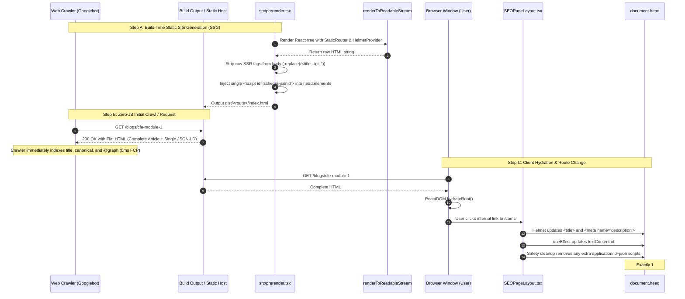

# Pre-render, Helmet & Single-Script Schema Architecture (`prerender-helmet-schema-flow.md`)

> **Project:** Academy of Internal Audit (`aia-website`)  
> **Topic:** Deep-dive technical explanation of how Build-Time Pre-rendering (`prerender.tsx`), Head Meta Management (`react-helmet-async`), and Single-Script Schema.org Graphs (`#schema-jsonld`) interact without duplicate tags or hydration conflicts.

---

## 1. Executive Problem Statement: Why Traditional Helmet Fails for JSON-LD

In a standard React Single Page Application (SPA), developers frequently write:

```tsx
// ❌ ANTI-PATTERN: DO NOT DO THIS!
<Helmet>
  <title>{pageTitle}</title>
  <meta name="description" content={description} />
  <script type="application/ld+json">
    {JSON.stringify(schemaData)}
  </script>
</Helmet>
```

### Why Placing JSON-LD Inside `<Helmet>` Causes Severe SEO Bugs:
1. **Hydration Duplication on Route Transitions:**  
   `react-helmet` (and `react-helmet-async`) handles `<title>` and `<meta>` tags by replacing their content when attributes match. However, with `<script>` tags, Helmet frequently appends a **new** `<script>` element to `document.head` on route transition without tearing down the previous page's script.
2. **"Multiple Unlinked Entities" Google Search Console Warning:**  
   As the user navigates from Home $\rightarrow$ Courses $\rightarrow$ Blog, the `<head>` accumulates 3, 4, or 5 conflicting `<script type="application/ld+json">` tags simultaneously. Search crawlers flag duplicate `Organization`, `WebSite`, and broken `@id` references.
3. **SSR Body Artifact Pollution:**  
   During static server-side rendering, if components render Helmet tags inside the body, the HTML body can end up containing duplicated `<title>` and `<meta>` tags in both the `<head>` and inside `<body>`.

---

## 2. The Solution: The Two-Tiered Separation of Concerns

To eliminate duplicates permanently, we enforce a strict separation of concerns:

```
┌────────────────────────────────────────────────────────────────────────┐
│                        SEO RESPONSIBILITY SPLIT                        │
├───────────────────────────────────┬────────────────────────────────────┤
│         react-helmet-async        │      Dedicated DOM Effect Sync     │
├───────────────────────────────────┼────────────────────────────────────┤
│ • Document <title>                │ • EXACTLY ONE <script> in <head>   │
│ • <meta name="description">       │ • id="schema-jsonld"               │
│ • <meta name="keywords">          │ • type="application/ld+json"       │
│ • <link rel="canonical">          │ • Encapsulates the entire @graph   │
│ • OpenGraph (og:title, og:image)  │ • Purges stray or duplicate scripts│
│ • Twitter Cards                   │ • Synchronizes on every navigation │
└───────────────────────────────────┴────────────────────────────────────┘
```

---

## 3. End-to-End Architectural Trace



---

## 4. Implementation Deep-Dive

### A. Build-Time Pre-rendering ([src/prerender.tsx](file:///d:/JOB_PROJECTS/igli/src/prerender.tsx))

During `vite build`, `prerender({ url })` performs three critical safety operations:

#### 1. Asynchronous Stream Rendering with Lazy Resolution:
```typescript
async function renderToStringAsync(element: React.ReactNode): Promise<string> {
  const { renderToReadableStream } = await import('react-dom/server');
  const stream = await renderToReadableStream(element, {
    onError(err) {
      console.warn('⚠️ [SSG SSR warning]:', err);
    },
  });
  // Await stream.allReady to guarantee all React.lazy() imports and Suspense boundaries resolve
  await stream.allReady;
  return await new Response(stream).text();
}
```

#### 2. Body Artifact Sanitization:
```typescript
// Strip raw tags emitted inside the body during component rendering
const html = rawHtml
  .replace(/<title[^>]*>[\s\S]*?<\/title>/gi, '')
  .replace(/<script[^>]*type="application\/ld\+json"[^>]*>[\s\S]*?<\/script>/gi, '')
  .replace(/<meta[^>]*>/gi, '')
  .replace(/<link[^>]*>/gi, '');
```

#### 3. Deterministic Head & Schema Injection:
```typescript
// Authoritative head elements with data-rh="true" to bridge SSG with React Helmet
const elements = new Set<Record<string, unknown>>([
  { type: 'meta', props: { name: 'description', content: seo.description, 'data-rh': 'true' } },
  { type: 'meta', props: { name: 'keywords', content: seo.keywords, 'data-rh': 'true' } },
  { type: 'link', props: { rel: 'canonical', href: canonical, 'data-rh': 'true' } },
  { type: 'meta', props: { name: 'robots', content: seo.noIndex ? 'noindex, nofollow' : 'index, follow', 'data-rh': 'true' } },
  { type: 'meta', props: { property: 'og:title', content: seo.title, 'data-rh': 'true' } },
  { type: 'meta', props: { property: 'og:description', content: seo.description, 'data-rh': 'true' } },
  { type: 'meta', props: { property: 'og:url', content: canonical, 'data-rh': 'true' } },
  { type: 'meta', props: { property: 'og:type', content: isArticle ? 'article' : 'website', 'data-rh': 'true' } },
  { type: 'meta', props: { property: 'og:image', content: ogImage, 'data-rh': 'true' } },
  { type: 'meta', props: { name: 'twitter:card', content: 'summary_large_image', 'data-rh': 'true' } },
  { type: 'meta', props: { name: 'twitter:title', content: seo.title, 'data-rh': 'true' } },
  { type: 'meta', props: { name: 'twitter:description', content: seo.description, 'data-rh': 'true' } },
  { type: 'meta', props: { name: 'twitter:image', content: ogImage, 'data-rh': 'true' } },
]);

// Inject single unified @graph script
if (seo.schemas.length > 0) {
  elements.add({
    type: 'script',
    props: {
      type: 'application/ld+json',
      id: 'schema-jsonld',
      'data-rh': 'true',
    },
    children: JSON.stringify(createCompositeGraph(seo.schemas)),
  });
}
```

---

### B. Client-Side Runtime Deduplication & Canonical Sync ([src/components/SEOPageLayout.tsx](file:///d:/JOB_PROJECTS/igli/src/components/SEOPageLayout.tsx))

In the browser, every page component is wrapped in `<SEOPageLayout>`:

```tsx
export default function SEOPageLayout({
  seo,
  structuredSchemas = [],
  children,
}: ModularPageProps): React.JSX.Element {
  const finalCanonical = getCanonicalUrl(seo.canonicalPath);
  const pageGraphPayload =
    structuredSchemas.length > 0 ? createCompositeGraph(structuredSchemas) : null;

  React.useEffect(() => {
    // 1. Synchronize Document Title
    if (seo.title) document.title = seo.title;

    // 2. Synchronize Canonical Link Tag (ensures exact match on client-side route transitions)
    let canonicalEl = document.querySelector('link[rel="canonical"]') as HTMLLinkElement | null;
    if (canonicalEl) {
      canonicalEl.setAttribute('href', finalCanonical);
    } else {
      canonicalEl = document.createElement('link');
      canonicalEl.setAttribute('rel', 'canonical');
      canonicalEl.setAttribute('href', finalCanonical);
      document.head.appendChild(canonicalEl);
    }

    // Deduplicate canonical tags if multiple exist in head
    const allCanonicals = document.querySelectorAll('link[rel="canonical"]');
    if (allCanonicals.length > 1) {
      for (let i = 1; i < allCanonicals.length; i++) {
        allCanonicals[i].remove();
      }
    }

    // 3. Synchronize Meta Description & Keywords
    let descEl = document.querySelector('meta[name="description"]') as HTMLMetaElement | null;
    if (descEl) {
      descEl.setAttribute('content', seo.description || '');
    }

    // 4. Synchronize OpenGraph Meta Tags
    const updateOg = (prop: string, content: string) => {
      let el = document.querySelector(`meta[property="${prop}"]`) as HTMLMetaElement | null;
      if (el) el.setAttribute('content', content);
    };
    updateOg('og:title', seo.title || '');
    updateOg('og:description', seo.description || '');
    updateOg('og:url', finalCanonical);

    // 5. In-place update of existing schema script tag
    if (!pageGraphPayload) return;
    const jsonStr = JSON.stringify(pageGraphPayload);
    const existing = document.getElementById('schema-jsonld') as HTMLScriptElement | null;

    if (existing) {
      if (existing.textContent !== jsonStr) {
        existing.textContent = jsonStr;
      }
    } else {
      const script = document.createElement('script');
      script.id = 'schema-jsonld';
      script.type = 'application/ld+json';
      script.textContent = jsonStr;
      document.head.appendChild(script);
    }

    // Purge any duplicate or stray application/ld+json tags in document.head
    const allLdScripts = document.head.querySelectorAll('script[type="application/ld+json"]');
    if (allLdScripts.length > 1) {
      for (let i = 1; i < allLdScripts.length; i++) {
        allLdScripts[i].remove();
      }
    }
  }, [seo, finalCanonical, pageGraphPayload]);

  return (
    <>
      <Helmet>
        <title>{seo.title}</title>
        <meta name="description" content={seo.description} />
        <meta name="keywords" content={seo.keywords} />
        <link rel="canonical" href={finalCanonical} />
        <meta name="robots" content={seo.noIndex ? 'noindex, nofollow' : 'index, follow'} />
        <meta property="og:title" content={seo.title} />
        <meta property="og:description" content={seo.description} />
        <meta property="og:url" content={finalCanonical} />
        <meta property="og:type" content="website" />
        <meta name="twitter:card" content="summary_large_image" />
        <meta name="twitter:title" content={seo.title} />
        <meta name="twitter:description" content={seo.description} />
      </Helmet>
      {children}
    </>
  );
}
```

### Dynamic Client-Side Metadata Synchronization (`blog-details.jsx`):
When running in client-side SPA mode or during Vite development (`bun dev`), dynamic routes fetch article data via TanStack Query. Once the article resolves:
* `blog-details.jsx` synchronizes `document.querySelector('meta[name="description"]')`, `og:description`, `twitter:description`, and `document.title` to the live article's `blog_meta_description` / `blog_short_description`.
* This ensures that SEO audit extensions and browser tabs show the exact database description immediately upon loading.

---

## 5. Verification: How to Confirm 0 Duplicate Schemas

You can verify that this architecture is functioning properly using three independent tests:

### 1. Automated CI Test:
```bash
bun run test:schema
```
* Parses all 191 HTML files in `dist/`.
* Throws an immediate error if `scripts.length !== 1` on any page.

### 2. Browser Console Verification:
Open DevTools Console on any page (Home, Blog, Course) and run:
```javascript
document.querySelectorAll('script[type="application/ld+json"]').length
// Result MUST be: 1

JSON.parse(document.getElementById('schema-jsonld').textContent)
// Result MUST show valid @context: "https://schema.org" and non-empty @graph
```

### 3. Google Rich Results Test:
Submit any URL to [Google Rich Results Test](https://search.google.com/test/rich-results).
* Verified: **No duplicate entity warnings**.
* Verified: **Connected Knowledge Graph** (`Organization` links to `WebSite`, `WebPage`, `Course`, `Review`, and `BlogPosting`).
* Verified: **0 warnings for datetime & timezone** (`datePublished` and `dateModified` formatted with `+05:30`).

---

## 6. Type Safety (`schema-dts`) & Google Datetime Compliance

### Why We Always Type Schemas with `schema-dts`:
1. **Zero Runtime Typos:** In Schema.org, case sensitivity and exact property names matter (`BlogPosting` vs `blogposting`, `headline` vs `title`, `itemReviewed` vs `item_reviewed`). Using `schema-dts` (`BlogPosting`, `Review`, `Product`, `Course`, `Organization`, etc.) guarantees compile-time verification.
2. **Full IDE Autocomplete:** When writing schemas, editors provide instant intellisense with official Schema.org property definitions, reducing development time and eliminating guesswork.

### Resolving Google Rich Results Datetime & Timezone Warnings:
Google's Structured Data linter enforces ISO-8601 with explicit timezone offsets for `datePublished` and `dateModified` in `BlogPosting` and `Review`.

* ❌ **The Problem:** Passing a plain SQL date string (e.g., `"2026-06-23"` or fallback `"2026-01-01"`) without a time and timezone triggers 4 non-critical warnings:
  1. `Invalid datetime value for "datePublished"`
  2. `Datetime property "datePublished" is missing a timezone`
  3. `Invalid datetime value for "dateModified"`
  4. `Datetime property "dateModified" is missing a timezone`

* ✅ **The Fix (`formatIsoDateWithTimezone`):**
  Normalizes all timestamps into a valid ISO-8601 string with timezone offset:
  ```typescript
  // Input: "2026-06-23" -> Output: "2026-06-23T00:00:00+05:30"
  datePublished: formatIsoDateWithTimezone(blog.blog_created),
  dateModified: formatIsoDateWithTimezone(blog.blog_updated || blog.blog_created),
  ```

* 🛡️ **Automated CI Gate:**
  `scripts/validateSchemas.ts` parses all pre-rendered HTML files and validates that every `datePublished` and `dateModified` property contains `'T'` and a timezone offset (`+` or `Z`), preventing broken releases from ever reaching production.

